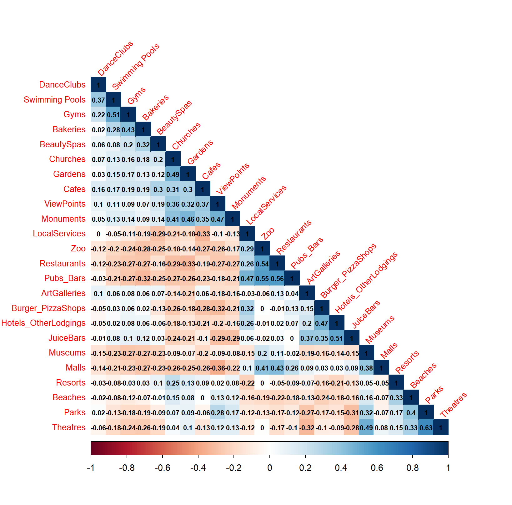
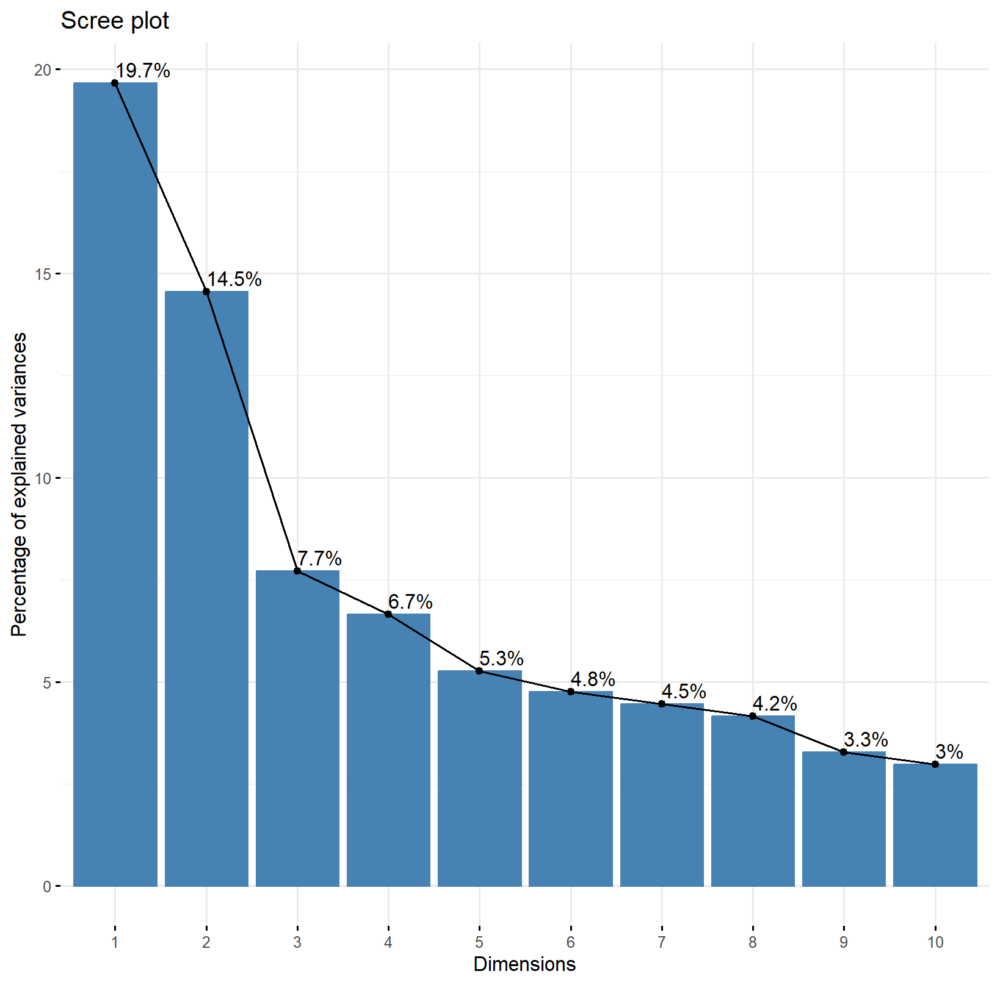
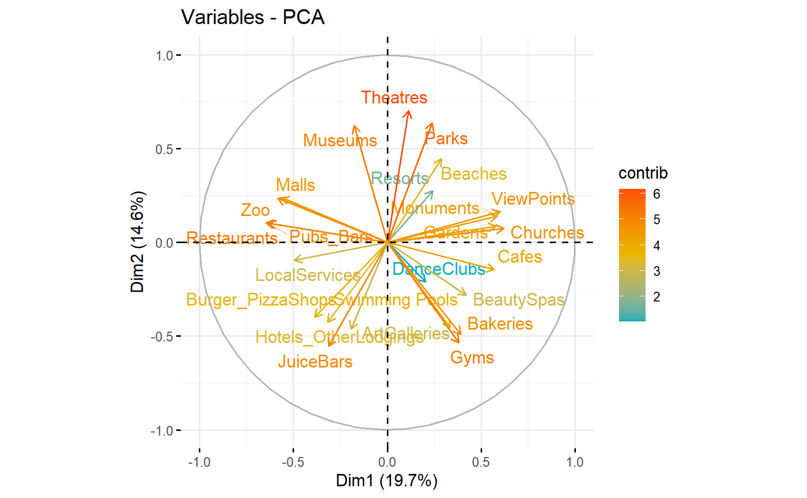
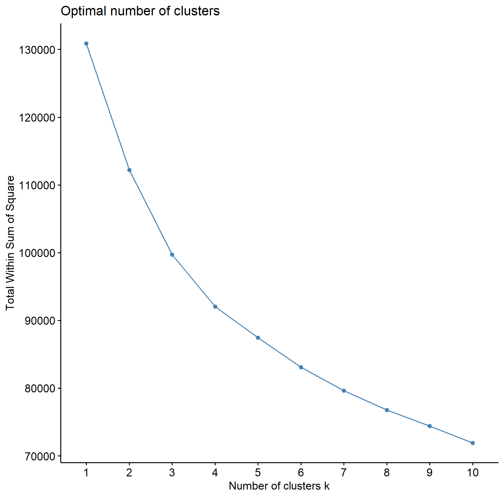
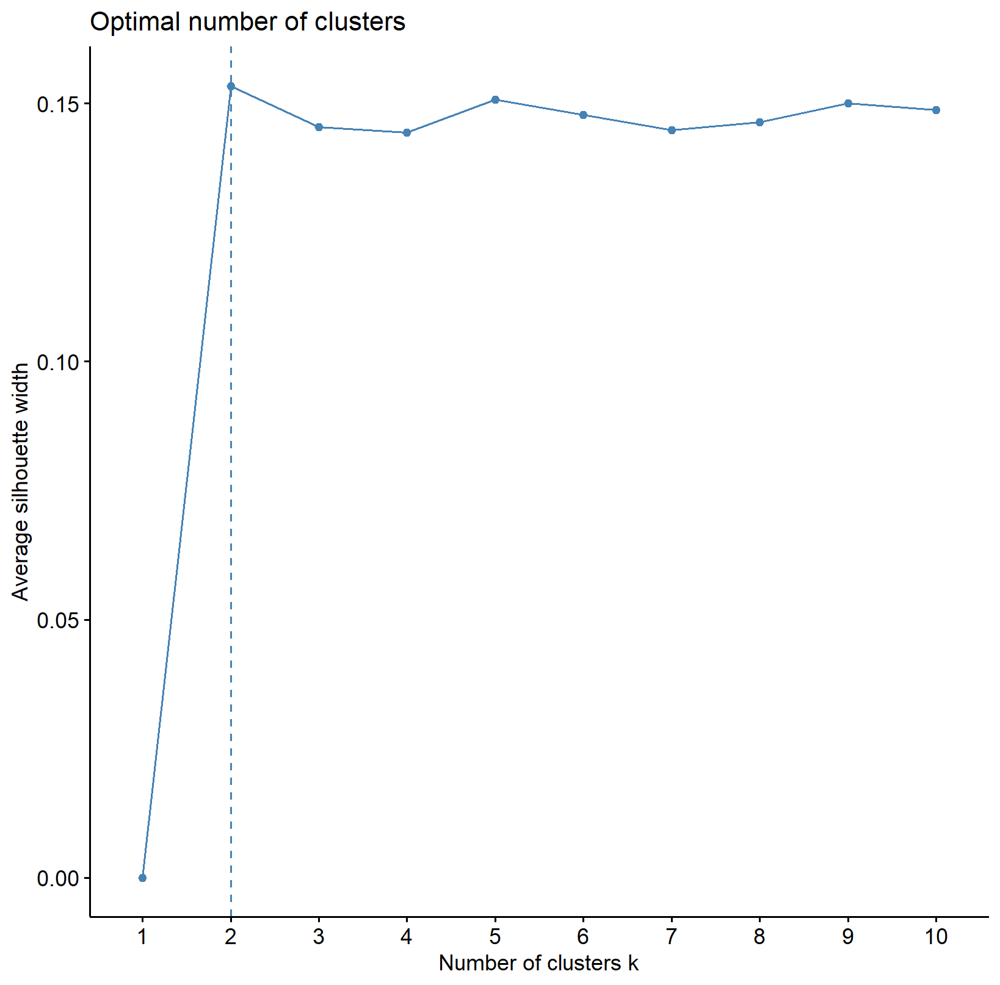
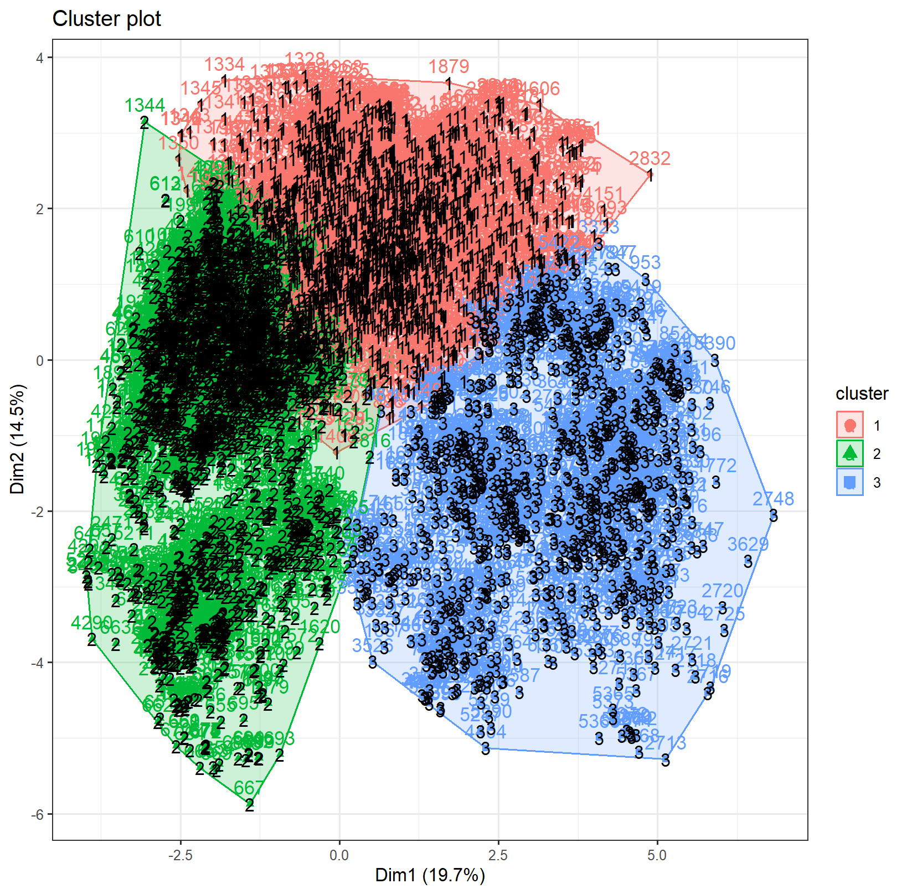

# Analyzing Destination Amenities with Principal Components Analysis(PCA) and different type of Clustering 

## Abstract 
Principal Component Analysis and clustering are powerful tools in Business Analytics. Without a target variable, these unsupervised methods allow us to look for relationships between variables to gain powerful insights about consumer tendencies. For this reason, Travelbiz tasked our team of consultants with developing several new travel packages as part of their venture into European travel. Throughout this analysis, we refer to a 2018 dataset of Google ratings to develop pattern recognition models and find connections between a variety of attributes. Ultimately, we hope to provide recommendations that will appeal to the customers of Travelbiz. 
##	Introduction 
Travelbiz is a longstanding player in the travel industry, providing well-planned and cost-effective packages to maximize customer satisfaction. Since establishing themselves in the American market, they have been looking to extend their offerings to European travel. This new business venture requires significant amounts of research on attractions, restaurants, and lodging. More importantly, it involves developing a strong understanding of their audience and their travel preferences. Using Machine Learning, we intend to explore relationships between customers and variables to facilitate this new endeavor. The aim is to provide insights that will help Travelbiz tailor their offerings and marketing strategies to meet the demands of their potential customers. 
##	Problem Statement 
At the forefront, Travelbiz is looking to create travel packages to Europe based on the needs of distinct customer groups. These needs are based on their preferences and ratings of European destinations, which were collected in 2018 and compiled into a dataset with 5456 observations and 25 variables. The challenge is to analyze the data to identify distinct customer segments, which will allow us to design unique travel packages that cater to their specific interests. To address this business challenge, we will employ dimensionality reduction techniques such as Principal Component Analysis (PCA) and clustering methods like k-means clustering. These tools are pivotal in exploring and understanding the relationships among variables, enabling us to accurately identify distinct market segments. This strategic approach will allow us to identify these segments for purposes of effective marketing. 
##	 Methodology  
###	Preprocessing 
To prepare our data for clustering, we performed an exploratory analysis of the variables to determine data types and review potential null values. Aside from the unique identifier, UserID, the features include Google ratings for multiple categories of European attractions, each scaled from zero to five. Because responses are limited to this range, we did not anticipate a presence of outliers that would affect cluster formation.  
It should be noted that there were a significant number of zero-ratings across 13 variables. Given that such ratings likely resulted from a user’s apathy toward a particular category, we were not concerned by this population. If we were to treat zero-ratings as missing and impute them with the feature’s mean or median, we would expect to see false trends in the data. Ultimately, considering the attractions that users choose not to rate may provide valuable insights.  
We did observe a single missing value in Gardens, which we chose to remove from the dataset because of its limited bearing on our analysis. We also removed the UserID column to further prevent false clustering patterns. At this point, our processed data was free of null values and inapplicable features, so we proceeded with additional data exploration.    
  ###	Data Exploration 
In preparation for our analysis, we ran a correlation plot to assess the relationships between variables. The resulting plot in Figure 1 displays the complexity of these relationships. With 24 continuous variables, there are moderate correlations across the dataset. 
For instance, the strongest positive relationship is between Parks and Theatres at 0.63, while the strongest negative relationship is between Viewpoints and Malls at -0.36.  There is also a high correlation between Restaurants and Pubs_Bars, which is unsurprising given the similarity of categories. Reviewing these immediate correlations ultimately provides insights into the tendencies of customers, which begin to shape our recommended travel packages. However, it also brings our attention to the need for dimensionality reduction. We will continue to refine our analysis using Principal Component Analysis, in which variables are transformed into orthogonal and uncorrelated vectors.  
##	Principal Component Analysis (PCA) 
Principal Component Analysis (PCA) is a method employed to simplify the complexity of a dataset while retaining the essential information. When applied to the Travelbiz dataset, PCA assists in uncovering the hidden patterns and connections between the variables that represent various facets of destinations as rated by users. 
Before delving into PCA, it's important to recognize the initial steps that are necessary for its successful implementation. We started the PCA process by scaling the data. This step is indispensable, as unscaled data could significantly affect our overall results for our PCA. By standardizing the dataset, we neutralized these potential distortions, laying a solid foundation for our PCA. 
The outcomes of the PCA show that the first seven principal components (“PCs”) account for 63.05% of the total variance in the dataset. In other words, the first seven components capture more than half of the variability in how users rate attractions. Figure 2 includes the eigenvalues associated with each PC and reveals the amount of variance explained by the component. The first PC has an eigenvalue of 4.72 and explains 19.66% of the variance, while the second PC has an eigenvalue of 3.49 and explains 14.55% of the variance.
 Ultimately, we identified seven as the optimal number of components by considering eigenvalues greater than one. This ensured that the resulting dimensions were comprised of more than one of the original variables.  
To review these dimensions, we assessed how the original variables are projected onto the principal components. In the Travelbiz dataset, the first two PCs might reveal that certain attributes like restaurants, pubs, and bars are closely related and contribute significantly to the first PC, while theaters, parks, and museums contribute more to the second PC. This suggests that there are different dimensions of user preferences, with one dimension related to nightlife and dining and another related to cultural and outdoor activities. 
The "Categories by Two PCS" graph in Figure 3 displays a broad range of user preferences on European destinations, as shown by the spread of data across the first two principal components.
 The first component (PC1) stretches along the x-axis from -3 to 5 and is heavily influenced by entertainment and historic sites such as restaurants and monuments, suggesting it represents interests in these areas. The second component (PC2), with values from -6 to 4 on the y-axis, appears related to cultural and leisure activities like parks and museums. The lack of clear clusters hints at the complexity and diversity of user preferences, indicating that Travelbiz may need to delve deeper into the data or consider additional factors to effectively segment the market and tailor their travel packages. 
By analyzing the contributions of the variables to each principal component, Travelbiz can consider which aspects of the destinations are most important to different segments of customers. This information can be compared alongside our cluster analysis to validate our proposed groupings.  
##	Clustering with K-Means 
After our Principal Component Analysis, we performed clustering analysis using the k-means algorithm. Though sensitive to the initial centroid position, this method is efficient and utilizes distance measures to minimize error. To initiate this method, we scaled our data to have a mean of zero and a standard deviation of one. Next, we worked to find the ideal number of clusters using the Elbow and Silhouette methods. The Elbow method plots the number of clusters against the total sum of squares, such that the optimal number of clusters is the point of diminishing returns. The resulting graph in Figure 4 reveals that there is no clear elbow across all attempted starting points. However, the sum of squares decreases at a slower rate starting around clusters three and four. 

In comparison, the Silhouette method seeks to maximize similarity within a cluster while maximizing dissimilarity between distinct clusters. In other words, this method is used to find the number of clusters that have the highest average silhouette width. Across all attempted starting points, the Silhouette method suggests that two is the optimal number of clusters, as indicated by the visualization in Figure 5. It should be noted that increasing the number of clusters does not drastically change the average silhouette width.  While this metric peaks at two clusters, the graph suggests that there may be other combinations to consider. 

After careful review of the Elbow and Silhouette outputs, as well as trial and error with different numbers of clusters, we decided that three was the optimal number. If we limited our groupings to two, we would be dismissing much of the dataset’s complexity and limiting the possibilities for tailored travel packages. On the other hand, using a larger number of clusters would reduce interpretability and waste marketing efforts on redundant groupings. Using three clusters performs optimally on both the Elbow and Silhouette plots while striking a balance between the previous concerns. Additionally, using three clusters seems to result in distinguishable characteristics between travelers.   
We initiated the k-means algorithm across multiple centroid starting points using Euclidian distance. While changes were minimal across attempts, we found that using an “nstart” of 100 produced a satisfactory division of clusters. The resulting algorithm places 2019 observations in Cluster 1, 1016 observations in Cluster 2, and 2419 observations in Cluster 3. A representation of these groups across two dimensions can be seen in Figure 6.
 Because our data contains more than two features, the graph defaults to plotting the first and second Principal Components. As previously discussed, the main contributors to the first PC include restaurants, pubs, churches, viewpoints, monuments. Meanwhile, the second PC mainly consists of theaters, parks, museums, juice bars, gyms, and bakeries. In understanding the plotted dimensions, we can identify that the first cluster displays a moderate interest in PC 1’s features, but a limited interest in those for PC 2. Meanwhile, the second and third clusters display a moderate interest in PC 2, with varying interests for PC 1. Thus, we see that using Principal Components in tandem with k-means is useful in visualizing results across more than two variables. Despite the barriers to interpretability, dimensionality reduction provides a valuable reference with which to validate our clustering results.  
To analyze the performance of the clusters, we created a silhouette plot, which compares the similarity of points within and between clusters and plots the silhouette width in a range from –1 to 1. Reviewing Figure 7, observations closer to -1 suggest that the observation may be better suited for another cluster, while a silhouette width closer to 0 indicates that the observation was located at a decision boundary. Ideally, the average silhouette surpasses the dotted line for all observations within a cluster, and values closer to 1 indicate the point is well matched with its current grouping. For our algorithm, the average silhouette width was 0.15, which explains a moderate amount of separation between the clusters. There appear to be several observations that extend below the average silhouette width, and even below zero. The complexity of our data minimizes the ability for clear-cut separation, so these anomalies are unsurprising. Altogether, we are content with the similarity in cluster sizes, as well as the algorithm’s ability to simplify such distinct characteristics into three comprehensible groups.  
We proceeded to assess the centroids of each cluster across all 24 features. The centroids themselves refer to the scaled data, but still provide valuable insights into the preferences of each cluster. Though we will discuss these specific preferences in recommending travel packages, some immediate insights include that Cluster 1 has higher centroids for the beach, parks, theaters, while Cluster 2 has the higher centroids for churches, monuments, and the spa. Additionally, it is evident that Cluster 3 can be characterized by restaurants, pubs, and hotels.  
##	Conclusion 
Upon careful consideration of the clusters and their associated features, we recommend that Travelbiz implement three unique travel packages in their efforts to extend business to Europe. These packages are built upon the clusters observed in our analysis and cater to complex travel preferences.  
###	Cluster 1: The Explorer 
In focusing on the centroids of the variables in Cluster 1, it is apparent that the individuals in this cluster love the outdoors. They don’t gravitate toward classic tourist destinations, such as monuments and churches. Rather, they love to incorporate cultural activities with their outdoor destinations. Thus, we recommend implementing “The Explorer” package to allow travelers to indulge in outdoor hobbies during the day and immerse themselves in cultural activities at night. This package’s itinerary may involve spending a day at the park, then venturing back to the city for a theatrical performance. Considering how these preferences translate to the specific destination will help Travelbiz target strategies effectively.  
###	Cluster 2: The Tourist 
The individuals in Cluster 2 are not afraid of being mainstream. With preferred activities of touring churches and visiting monuments, landmarks are a necessary component of their itinerary. However, it seems these travelers like to maximize their trip in other ways as well. With affinities for spas, nightclubs, and cafes, it is apparent that this type of traveler wants to explore anything the destination has to offer. Thus, “The Tourist” package may include a guided landmark tour in the morning, midday spa appointment, and sunset visit to a local viewpoint.  
###	Cluster 3: The Foodie  
The individuals in Cluster 3 seek to explore the destination through food. With larger centroids in restaurants and pubs, this type of traveler seeks to try cultural dishes while partaking in less-touristy activities. Our proposed “Foodie” package incorporates a unique blend of preferences. In addition to booking highly-rated restaurants, this package may recommend visits to the local mall, art gallery, or zoo.  
###	Final Takeaways  
To optimize the insights from our analysis, we suggest that Travelbiz implement marketing strategies based on the specific interests of each customer segment. It’s crucial for Travelbiz to regularly update and refine these packages based on customer feedback and evolving trends. This proactive approach will ensure that the offerings remain relevant and appealing. Additionally, expanding data collection to include customer demographics, travel history, and feedback will enable even more precise tailoring of travel packages. 
 

